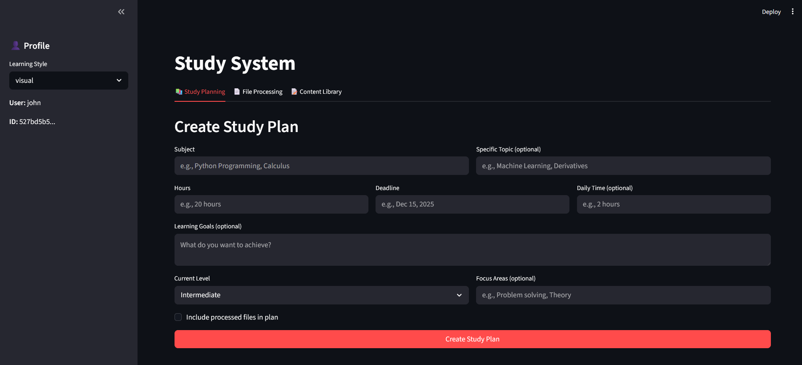
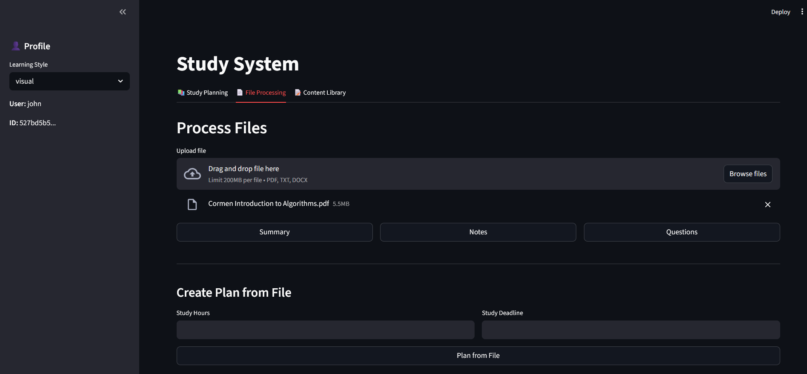

# Study Agent

An AI-powered study assistant built with Streamlit. Upload files, generate study plans, and get personalized learning content based on your learning style.




## Features

- **Study Planning** — Generate detailed weekly study plans with daily schedules, milestones, and techniques tailored to your learning style
- **File Processing** — Upload PDFs, DOCX, or TXT files and get summaries, notes, or practice questions
- **Content Library** — All generated content is saved per user and downloadable
- **Learning Styles** — Visual, auditory, reading, or custom — the AI adapts all output to your preference

## Setup

### 1. Install dependencies

```bash
pip install streamlit openai python-dotenv PyPDF2 python-docx
```

### 2. Set your API key

Create a `.env` file in the project root:

```
OPENROUTER_API_KEY=your_key_here
```

Get a free key at [openrouter.ai](https://openrouter.ai).

### 3. Run

```bash
streamlit run app.py
```

Open [http://localhost:8501](http://localhost:8501) in your browser.

## Usage

1. Enter a username to log in (your data is saved to this username)
2. Set your learning style in the sidebar
3. Use the tabs:
   - **Study Planning** — Enter a subject, hours, deadline, and goals to get a full plan
   - **File Processing** — Upload a file and generate a summary, notes, or questions
   - **Content Library** — View and download all previously generated content

## Project Structure

```
study_agent/
├── app.py                      # Streamlit UI
├── base_agent.py               # Base agent (OpenRouter API, user context)
├── study_planner_agent.py      # Generates study plans and recommendations
├── content_processor_agent.py  # Reads files and generates study content
├── SQLiteState.py              # SQLite persistence layer
└── study_system.db             # Database (auto-created)
```

## Models

Uses `deepseek/deepseek-chat-v3-0324:free` via OpenRouter (free tier).
